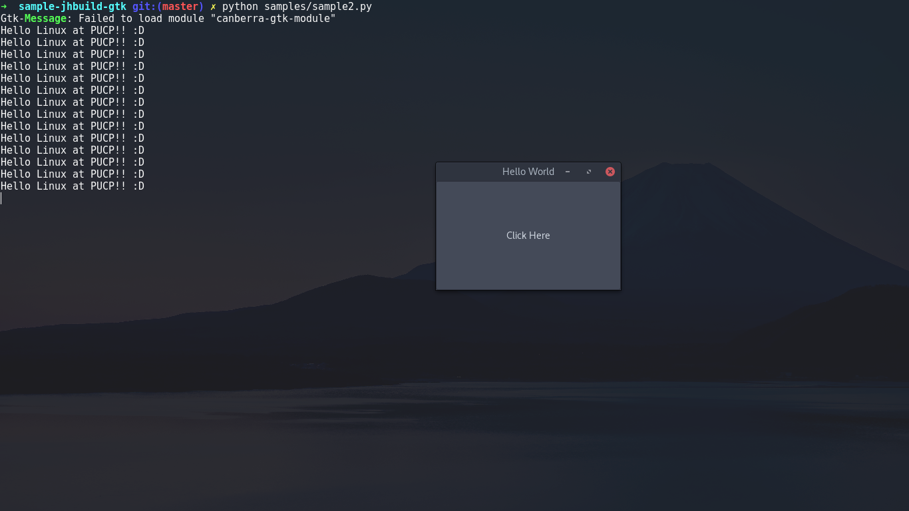

# Primeros pasos en jhbuild, pygobject y gtk

[][1]
[![MIT License][2]][1] [![Python][3]][1] [![jhbuild][4]][1] [![Gtk+][5]][1]

## Guia de instalacion

1. `cd ~`
2. `mkdir ~/development/`
3. `cd ~/development/`
4. `git clone git://git.gnome.org/jhbuild`
5. `cd ./jhbuild`
7. `./autogen`
   Si hay mensajes de alerta al ejcutar esta instrucción, instalar todos los paquetes listados. En el caso del paquete `gettext`, intalar la version de desarrollo (`dev` o `devel`)
8. `make`
   Verificar y corregit errores que puedan aparecer
9. `make install`
10. `echo "export PATH=$PATH:$(cd ~; pwd)/.local/bin" >> ~/.bashrc`
    Si usas zsh, cambia `bashrc` por `zshrc`.
10. `source ~/.bashrc`
    Si usas zsh, cambia `bashrc` por `zshrc`.
11. `jhbuild sanitycheck`
12. `jhbuild sysdeps --install`
13. `jhbuild build pygobject`
14. `jhbuild build gtk+-3`
15. `jhbuild shell`
16. `cd ~/developement`
17. `mkdir sample-jhbuild-gtk`
18. `cd sample-jhbuild-gtk`
19. `Listo para programar en python con gtk` :snake: :octocat:

# Autores

* [@zodiacfireworks](https://github.com/zodiacfireworks)
* [@sheylabre](https://github.com/sheylabre)

[1]: git@github.com:softbutterfly/sample-jhbuild-gtk.git
[2]: https://img.shields.io/badge/License-MIT-blue.svg?maxAge=2592000&style=flat-square
[3]: https://img.shields.io/badge/Language-Python-green.svg?maxAge=2592000&style=flat-square
[4]: https://img.shields.io/badge/Tool-jhbuild-green.svg?maxAge=2592000&style=flat-square
[5]: https://img.shields.io/badge/Tool-Gtk+-orage.svg?maxAge=2592000&style=flat-square
